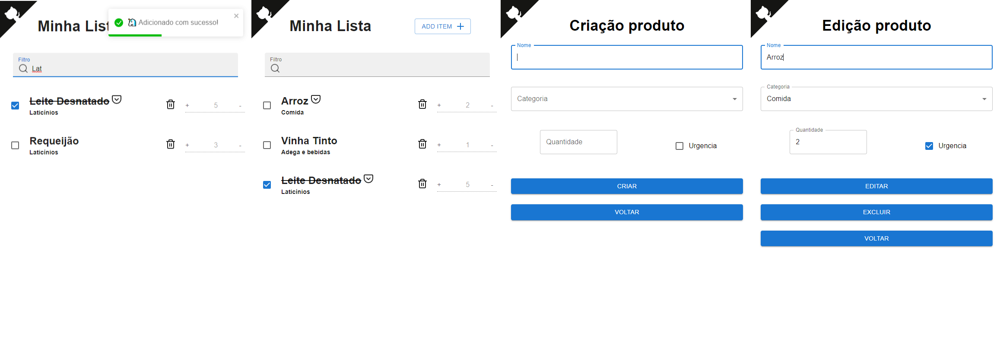

# Lista de compras

[ListaDeCompras](https://rafaelangelo1999.github.io/React.ListaDeCompra/) aplicativo para gerenciar lista de compras, onde é possível cadastrar itens por categorias já pré cadastradas e gerenciar esses ativos em tempo real, como por exemplo:

- [x] Cadastrar com status de urgência
- [x] Gerenciar unidades
- [x] Gerenciar categoria

Com essas funcionalidades é possível que o usuário gerencie todas as suas pendências de compras, não esquecendo de mais nada durante a ida ao supermercado

### Telas

- Na tela inicial, exibimos a lista de produtos cadastrados para a proxima compra do usuario. No header temos o total de produtos inseridos na lista e o botão de adicionar novo produto

- Na tela de cadastrar um novo produto, é possível informar o nome, categoria, quantidade e a urgencia da compra.

- Na tela de edição é possível alterar todos os dados já informados anteriormente e também excluir o produto da lista de compras.

## 2. Dados do usuário

A lista de compras do usuario e armazenada em cache para ser acessados posteriomente sem internet

## 3. Checklist de implementação

- A aplicação é original e não uma cópia da aplicação de um colega ou de uma aplicação já existente? **Sim**
- A aplicação tem pelo menos duas interfaces (telas ou páginas) independentes? **Sim**
- A aplicação armazena e usa de forma relevante dados complexos do usuário? **Sim**
- A aplicação foi desenvolvida com o React? **Sim**
- A aplicação contém pelo menos dois componentes React além do componente principal? **Sim**
- O código da minha aplicação possui comentários explicando cada operação? **Sim**
- A aplicação está funcionando corretamente? **Sim**
- A aplicação está completa? **Sim**

## 4. Bibliotecas externas utilizadas
* [material-ui](https://www.npmjs.com/package/@material-ui/core) : Fremework de componentes estilizados
* [react-router-dom](https://www.npmjs.com/package/react-router-dom) : Configuração e redirecionamento de URL e renderização dos componentes
* [reduxjs-toolkit](https://www.npmjs.com/package/@reduxjs/toolkit) : Facilitador para implementação do paradigma Redux de um jeito menos verboso 
* [feather-icons-react](https://www.npmjs.com/package/feather-icons-react) : Icons
* [react-toastify](https://www.npmjs.com/package/react-toastify) : Visualização dos toasty
* [react-hook-form](https://www.npmjs.com/package/react-hook-form) : Gerenciar formularios
